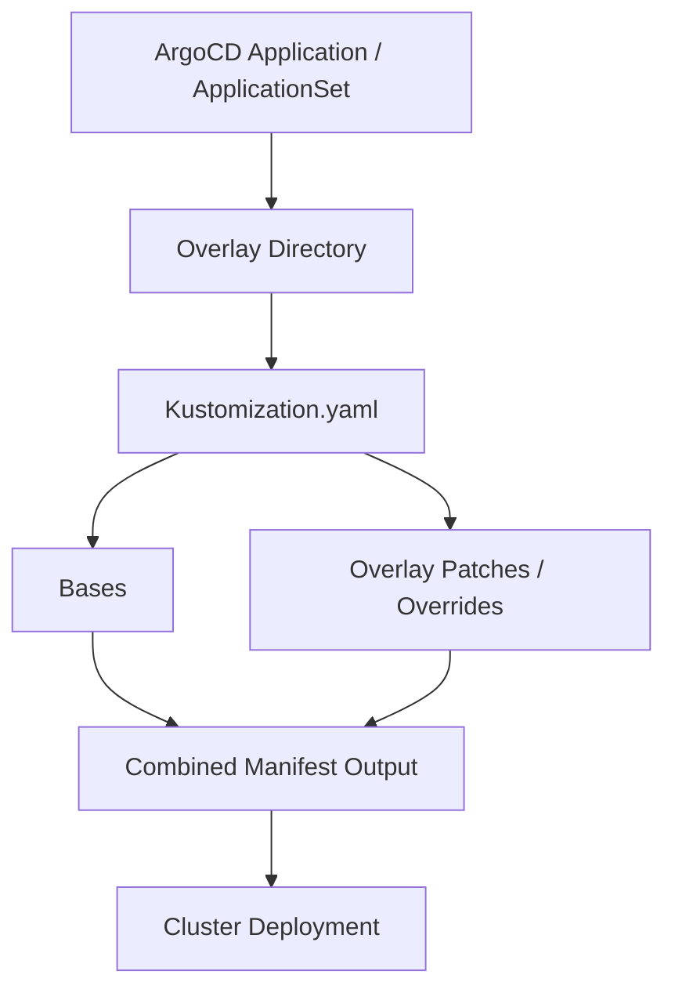
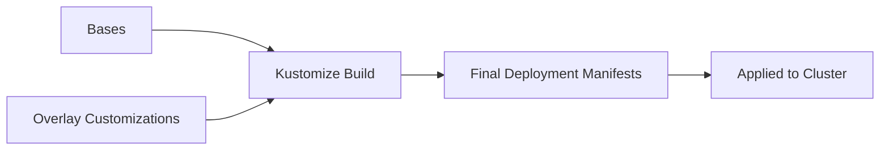

# GitOps Architecture — Bases and Overlays with Kustomize (Lowkey needs to be updated)

## Overview

This repository follows a **Kustomize-based GitOps design** that separates reusable configuration from environment-specific customization.

The primary goal is to create a structure that is:

* Reusable across clusters and environments
* Easy to maintain and scale
* Clear for contributors to understand
* Fully declarative and GitOps friendly

This repository uses two key concepts:

```
/bases      → Reusable shared configuration
/overlay    → Environment or cluster-specific customization
```

Together, these directories allow flexible and scalable deployment patterns using Kustomize.

---

# Why Bases and Overlays Exist

In real-world platform engineering, many clusters share common components such as:

* Monitoring stack
* Logging stack
* Operator installation
* Networking configuration
* Platform services
* Standard application frameworks

However, each environment or cluster typically requires:

* Different resource sizes
* Feature toggles
* Site-specific configuration
* Cluster-specific settings
* Hardware or topology adjustments

Kustomize allows us to combine shared configuration with targeted customization in a clean and maintainable way.

---

# High-Level Architecture



---

# Bases Directory

## Purpose

The `/bases` directory contains **shared reusable configuration** that is intended to be consumed by multiple overlays.

Bases represent the standard building blocks of platform or application deployment.

---

## Characteristics of Bases

Bases should:

* Be environment-agnostic
* Contain stable reusable configuration
* Avoid cluster-specific customization
* Represent common deployment patterns

---

## Example Base Components

```
bases/
├ monitoring/
├ logging/
├ operators/
├ storage/
└ applications/
```

---

## Example Base Structure

```
bases/monitoring/
├ kustomization.yaml
├ prometheus.yaml
├ grafana.yaml
```

Bases define the default or standard configuration that overlays can reuse.

---

# Overlay Directory

## Purpose

The `/overlay` directory contains **environment or cluster-specific configuration** that customizes base components.

Each overlay represents a deployment target such as:

* A specific cluster
* A specific environment (lab, dev, production)
* A specific edge or site deployment
* A specific topology or hardware profile

---

## Example Overlay Structure

```
overlay/
└── my-sno-cluster/
    ├── kustomization.yaml
    ├── patches/
    ├── config-overrides.yaml
    └── additional-resources.yaml
```

---

# How Bases and Overlays Work Together

Overlays reference bases using Kustomize and apply modifications using patches or additional configuration.

---

## Example Overlay kustomization.yaml

```yaml
resources:
  - ../../bases/monitoring
  - ../../bases/operators

patchesStrategicMerge:
  - patches/grafana-size.yaml
  - patches/prometheus-storage.yaml
```

---

## Deployment Flow



---

# What Happens During Deployment

1. Argo CD targets an overlay directory.
2. Kustomize processes the overlay `kustomization.yaml`.
3. Overlay references required bases.
4. Overlay applies patches and customizations.
5. Kustomize generates final manifests.
6. Argo CD applies rendered resources to the cluster.

---

# Example Real-World Workflow

## Shared Monitoring Configuration

```
bases/monitoring
```

Contains:

* Grafana deployment
* Prometheus configuration
* Default dashboards
* Standard alert rules

---

## Cluster-Specific Monitoring Customization

```
overlay/my-sno-cluster
```

May customize:

* Storage size
* Retention policies
* Resource limits
* Site-specific dashboards

---

# Why This Design Is Powerful

## Reusability

Multiple clusters can share base components without duplicating configuration.

---

## Maintainability

Updates to shared configuration only need to occur once in the base.

---

## Scalability

New clusters or environments can be created by adding overlays.

---

## Consistency

Ensures standardized platform deployments across environments.

---

# Typical Deployment Layering

```mermaid
flowchart TD

A[Bootstrap GitOps Initialization]
   ↓
B[ArgoCD Platform Configuration]
   ↓
C[Application / ApplicationSet]
   ↓
D[Overlay Directory]
   ↓
E[Bases + Overlay Customization]
   ↓
F[Cluster Deployment]
```

---

# Best Practices

## Bases

* Keep them generic and reusable
* Avoid environment-specific configuration
* Maintain stable interfaces for overlays

---

## Overlays

* Keep customization minimal and targeted
* Document purpose clearly
* Avoid duplicating base logic
* Use patches instead of copying resources

---

# Naming Strategy

Overlays should clearly represent deployment targets.

Examples:

```
overlay/
├ sno-lab-cluster
├ sno-edge-site-a
├ production-regional-cluster
```

---

# Adding a New Cluster or Environment

To deploy a new cluster configuration:

1. Create a new overlay directory
2. Reference required bases
3. Add environment-specific patches
4. Update Argo CD Application or ApplicationSet
5. Submit changes via Pull Request

---

# Troubleshooting Tips

If deployment fails:

* Validate overlay `kustomization.yaml`
* Confirm base paths are correct
* Review patch syntax
* Inspect rendered manifests in Argo CD
* Confirm RBAC permissions allow resource creation

---

# Disaster Recovery Benefits

Because both bases and overlays are stored in Git:

Clusters can be fully recreated by:

1. Installing GitOps platform
2. Reapplying bootstrap
3. Argo CD redeploys overlays
4. Kustomize rebuilds full configuration automatically

---

# Summary

This repository uses a layered Kustomize approach where:

* `/bases` provide reusable shared configuration
* `/overlay` customizes configuration for specific environments or clusters
* Argo CD deploys overlays which combine both layers into final cluster resources

This architecture supports scalable, consistent, and maintainable GitOps-driven platform engineering.

---
