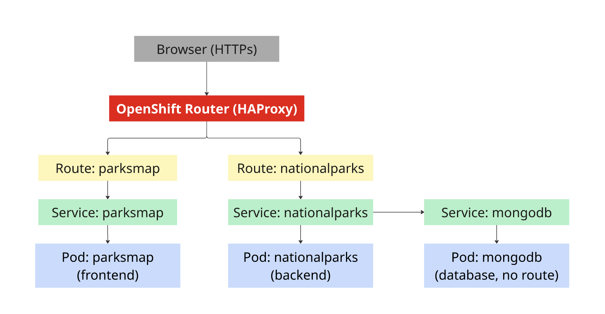

# OCP Deployment Workshop: Helm on OpenShift

A hands-on workshop for deploying applications to OpenShift using Helm. You will deploy a chart across two environments with different security restrictions, and debug real-world failures — all from inside Red Hat OpenShift Dev Spaces.

---

## The Story

You are a developer joining the **ParksMap** team. The application displays national parks on a map, backed by a REST API and a MongoDB database. Your team has been deploying using the OpenShift web console — it is time to move to infrastructure-as-code using **Helm**.

---

## Prerequisites

- Completed the **OpenShift Basics** class
- Completed the **ParksMap clickops lab**
- Access to workshop namespaces — `challenge1` and `challenge2`
- Optional challenge namespaces (if running Parts 7-8): `challenge3`, `challenge4-staging`, `challenge4-production`
- A Red Hat OpenShift account with Dev Spaces enabled

---

## Workshop Structure

| Section | Time | Description |
|---------|------|-------------|
| [Part 1: Helm Foundations](01-helm-foundations/) | ~30 min | Deploy to DEV using a Helm chart |
| [Part 2: Production Readiness](02-production-readiness/) | ~30 min | Debug and fix a broken deployment in SIT |
| [Bonus Challenge: Helm Troubleshooting](03-bonus-deployment/) | ~15 mins | Debug and deploy a third-party Helm chart |
| [Optional: Kustomize Base + Overlay](04-kustomize-challenge/) | If time permits | Deploy with Kustomize overlay and update app by changing one variable |

---

## Part 1 — Launch Your Dev Spaces Workspace

### Step 1.1 — Open Dev Spaces

1. Log in to your OpenShift web console.
2. Click the **grid launcher icon** (⋮⋮⋮) in the top-right corner.
3. Select **Red Hat OpenShift Dev Spaces**.

> If Dev Spaces is not in the launcher, ask your workshop conductor.

### Step 1.2 — Create a Workspace

1. Click **Create Workspace**.
2. Under **Choose an Editor**, select **VS Code - Opensource**.
3. In the **Import from Git** field, paste:
   ```
   https://gitlab.com/betterthanbot/ocp-deployment-workshop.git
   ```
   
   If you get a rate limit, do try to import from GitHub instead with this link
   ```
   https://github.com/betterthanbot/ocp-deployment-workshop.git
   ```
4. Click **Create & Open**.

Dev Spaces will clone the repository and launch a browser-based VS Code with all workshop files ready in the explorer.

> **What is `devfile.yaml`?** It tells Dev Spaces which container image to use for your workspace — one that already has `helm`, `oc`, and other tools pre-installed. You don't need to touch it.

---

### Step 1.3 — Open a Terminal & Verify Setup

1. Click **Terminal → New Terminal** in the top menu bar.
2. Run the following to confirm your tools and login:

```bash
helm version
oc version
oc whoami
```

3. Check your assigned namespaces:

```bash
oc projects
```

You should see `challenge1` and `challenge2`. **Note these down** — you will use them throughout the workshop.

---

## Part 2 — ParksMap Architecture and Environment Context

Three components wired together through OpenShift Routes, Services, and Deployments:



- The **frontend** discovers backends by looking up Services labelled `type: parksmap-backend`.
- The **backend** connects to MongoDB via the DNS name `mongodb` using `MONGODB_SERVER_HOST`.
- **MongoDB** is internal only — it has no Route.

With that traffic flow in mind, map it to the two environments you will deploy to:

### Dev vs SIT Environments

| Aspect | DEV | SIT |
|--------|-----|-----|
| Namespace | `challenge1` | `challenge2` |
| Purpose | Rapid testing | Stable integration testing |
| Image tags | `latest` allowed | `:latest` **blocked by ACS** |

### ⚠️ SIT: ACS Image Policy

The SIT namespace has **Red Hat Advanced Cluster Security (ACS)** informing on a policy that **looks for `:latest` image tags**. This is a real-world security control to catch unversioned images from reaching integration environments.

You will encounter this error during the SIT deployment — and fixing it is the exercise. 

---

## Part 3 — Hands-On Exercise 1: Deploy the Chart

> **Golden rule:** Always run `helm template` before `helm install` to catch mistakes before they hit the cluster.

---

### 3.1 — DEV Deployment

Navigate to the `01-helm-foundations` directory:

```bash
cd /projects/ocp-deployment-workshop/01-helm-foundations
```

**Preview what will be deployed:**

```bash
helm template parksmap ./ -f values-dev.yaml
```

Scan the output and confirm:
- Images are using the expected tags
- Namespace matches `challenge1`
- Routes have TLS configured

**Deploy:**

```bash
helm install parksmap ./ --values=values-dev.yaml -n challenge1
```

**Check everything is running:**

```bash
oc get pods -n challenge1
oc get jobs -n challenge1
oc get routes -n challenge1
```

> **Why check jobs?** The chart includes a database init job that seeds the national parks data — the same step you previously ran manually via the `/ws/data/load` endpoint. If the map loads but shows no parks, check the job logs:
> ```bash
> oc logs job/mongo-init -n challenge1
> ```

Open the route URL in your browser and confirm the map shows national parks. ✅

**When done, uninstall:**

```bash
helm uninstall parksmap -n challenge1
```

---

## Part 4 — Hands-On Exercise 2: SIT Deployment

### 4.1 — SIT Deployment

Navigate to the `02-production-readiness` directory:

```bash
cd /projects/ocp-deployment-workshop/02-production-readiness
```
**Change to your SIT working namespace:**

```bash
oc project challenge2
```

**Try deploying as-is first:**

```bash
helm install parksmap ./ --values=values-sit.yaml -n challenge2
```

You will see an ACS admission error — this is expected! The `values-sit.yaml` file still has `tag: latest` set for all images.

---

### 4.2 — Fix `values-sit.yaml`

Open `values-sit.yaml` in the VS Code file explorer. For **each image block**, comment out `tag: latest` and uncomment the `digest` line:

```yaml
# Before:
  image:
    repository: quay.io/rhn-support-gong/parksmap
    tag: latest
    # digest: sha256:89d1e324846cb431df9039e1a7fd0ed2ba0c51aafbae73f2abd70a83d5fa173b

# After:
  image:
    repository: quay.io/rhn-support-gong/parksmap
    # tag: latest
    digest: sha256:89d1e324846cb431df9039e1a7fd0ed2ba0c51aafbae73f2abd70a83d5fa173b
```

Repeat for `backend`, `database`, and `databaseinit`. All digests are pre-filled — just uncomment them.

> **Why digests?** A tag like `:latest` is mutable and can point to a different image at any time. A digest (`sha256:...`) is a cryptographic fingerprint tied to a specific image — it guarantees what you deploy is exactly what was tested.

---

### 4.3 — Verify and Redeploy

Uninstall the failed release:

```bash
helm uninstall parksmap -n challenge2
```

Preview the fixed templates — images should now show `@sha256:...` instead of `:latest`:

```bash
helm template parksmap ./ -f values-sit.yaml
```

Deploy:

```bash
helm install parksmap ./ --values=values-sit.yaml -n challenge2
```

**Check everything is running:**

```bash
oc get pods -n challenge2
oc get jobs -n challenge2
oc get routes -n challenge2
```

Open the route URL in your browser and confirm the map shows national parks. ✅

---

🎉 **Great progress!** You have deployed the same application across two environments using Helm, and resolved a real ACS security policy enforcement issue.

<!-- Next, continue with two short drills to build real-day-2 Helm operations skills. -->

---

## Part 5 — Hands-On Exercise 3: Safe Upgrade + Rollback 

This exercise teaches release lifecycle management using `helm upgrade`, `helm history`, and `helm rollback`.

### 5.1 — Reinstall Baseline in DEV

```bash
cd /projects/ocp-deployment-workshop/01-helm-foundations
helm upgrade --install parksmap ./ -f values-dev.yaml -n challenge1
oc get pods -n challenge1
```

### 5.2 — Perform a Safe Upgrade

Run a simple upgrade by overriding frontend replicas:

```bash
helm upgrade parksmap ./ -f values-dev.yaml -n challenge1 --set frontend.replicaCount=2 --set namespace=challenge1
oc rollout status deployment/parksmap -n challenge1
```
You should expect the rollout to succeed and the frontend runs with 2 replicas.

To view the list of Helm deployment revisions/history for this release:

```bash
helm history parksmap -n challenge1
```

Scale the Pods back to `replicaCount=1`:

```bash
helm upgrade parksmap ./ -f values-dev.yaml -n challenge1 --set frontend.replicaCount=1 --set namespace=challenge1
oc rollout status deployment/parksmap -n challenge1
```

You should now see a new Helm revision.

### 5.3 — Simulate a Bad Upgrade, Then Recover

Trigger a controlled failure by setting an invalid image tag:

```bash
helm upgrade parksmap ./ -f values-dev.yaml -n challenge1 --set frontend.image.tag=newest
oc get pods -n challenge1
```

You may notice one old `parksmap` pod stays `Running` while a new pod shows `ErrImagePull`.
This shows why **RollingUpdate** is useful: OpenShift keeps healthy pods serving while new ones start, so a bad image update is less likely to cause immediate downtime.

Inspect rollout/pod errors, then roll back to the previous good revision:

```bash
helm history parksmap -n challenge1
helm rollback parksmap -n challenge1
oc rollout status deployment/parksmap -n challenge1
```

**Key takeaway:** Use `helm history` + `helm rollback` to recover from bad releases without uninstalling and reinstalling.

---

## Part 6 — Exercise 4: Check Your Chart Before Deploying

This exercise reinforces a pre-deploy quality gate before cluster changes.

### 6.1 — Validate Part 1 Chart

**Important: include `-f values-dev.yaml` when linting this exercise. If you run only `helm lint ./`, Helm lints using the chart's default `values.yaml`.**

```bash
cd /projects/ocp-deployment-workshop/01-helm-foundations
helm lint ./ -f values-dev.yaml
helm template parksmap ./ -f values-dev.yaml > /tmp/parksmap-dev-rendered.yaml
```

### 6.2 — Validate Part 2 Chart

```bash
cd /projects/ocp-deployment-workshop/02-production-readiness
helm lint ./ -f values-sit.yaml
helm template parksmap ./ -f values-sit.yaml > /tmp/parksmap-sit-rendered.yaml
```

### 6.3 — Break/Fix Mini Challenge

Temporarily comment out one required value (for example an image `repository`) in `values-sit.yaml`, re-run `helm template`, observe failure, then restore the value and confirm validation passes again.

**Some Suggested break/fix scenarios:**

- **Scenario A: YAML syntax error (lint-time failure)**
  - File/key to break: `02-production-readiness/values-sit.yaml` -> `frontend.resources.requests`
  - Break it by removing the `:` from `requests:`
  - Run: `helm lint ./ -f values-sit.yaml`
  - Fix: restore `requests:` with valid indentation

- **Scenario B: Template type error (render-time failure)**
  - File/key to break: `02-production-readiness/values-sit.yaml` -> `backend.extraPorts`
  - Break it by changing:
    - from list: `- containerPort: 8443`, `- containerPort: 8778`
    - to boolean: `extraPorts: true`
  - Run: `helm template parksmap ./ -f values-sit.yaml`
  - Fix: restore `extraPorts` to a list of port objects

- **Scenario C: Kubernetes API validation error (deploy-time failure)**
  - File/key to break: `02-production-readiness/values-sit.yaml` -> `frontend.port`
  - Break it by changing `frontend.port: 8080` to `frontend.port: "eighty"`
  - Run: `helm upgrade --install parksmap ./ -f values-sit.yaml -n challenge2`
  - Fix: restore `frontend.port` to an integer (`8080`)

**Outcome:** You build a repeatable habit: `helm lint` + `helm template` before every deploy.

---

## Part 7 — Bonus Challenge: Helm Troubleshooting

Use this as a knowledge-check challenge after Exercises 1-4 to test what you've learned.
You will troubleshoot two checkpoints in `values.yaml`, then finish with `helm upgrade --install`.

Navigate to the `03-bonus-deployment` directory:

```bash
cd /projects/ocp-deployment-workshop/03-bonus-deployment
```
Use namespace `challenge3` for this challenge:

```bash
oc project challenge3
# If missing:
# oc new-project challenge3
```

### 7.1 — Checkpoint 1: Lint failure

Run:

```bash
helm lint ./
```

Fix the YAML syntax issue in `values.yaml` (`resources.requests` is intentionally malformed), then run `helm lint ./` again until it passes.

### 7.2 — Checkpoint 2: Deploy-time validation failure

Run:

```bash
helm upgrade --install my-web-app ./ -n challenge3
```

It should fail due to invalid Route TLS termination in `values.yaml`. Fix `route.tls.termination` to `edge`, then redeploy:

```bash
helm upgrade --install my-web-app ./ -n challenge3
oc get pods,svc,routes -n challenge3
```

**Goal:** Practice deploying a third-party chart with minimal guidance, like in real project handovers.

---

## Part 8 — Optional Exercise: Deploy with Kustomize Base + Overlay 

Now deploy a styled web app dashboard using Kustomize into **staging** and **production**.

Navigate to the `04-kustomize-challenge directory`:

```bash
cd /projects/ocp-deployment-workshop/04-kustomize-challenge
# Make sure these namespaces exist first:
# oc new-project challenge4-staging
# oc new-project challenge4-production
oc apply -k overlays/staging
oc get pods,svc,routes -n challenge4-staging
```

Get the staging route URL:

```bash
oc get route kustom-web -n challenge4-staging -o jsonpath='https://{.spec.host}{"\n"}'
```

Apply the production configuration:

```bash
oc apply -k overlays/production
oc rollout status deployment/kustom-web -n challenge4-production
```

Get the production route URL:

```bash
oc get route kustom-web -n challenge4-production -o jsonpath='https://{.spec.host}{"\n"}'
```

**Goal:** Learn Kustomize base/overlay workflow and config-driven rollouts.
Kustomize is built into `oc` and `kubectl` (`apply -k`) and follows a declarative model: you define desired state in files, then apply changes.
Helm is also declarative at deployment time, but it adds chart templating and release/version management (`install`, `upgrade`, `rollback`) on top.

---

🎉 **Hands-on complete!** You now practiced:
- Initial deployment in DEV
- Security-driven fix in SIT
- Upgrade and rollback operations
- Local validation gates before cluster changes
- Optional third-party chart deployment challenge
- Optional Kustomize base + overlay deployment

---

## Helm Quick Reference

### Core Commands

```bash
helm lint ./                                                         # Validate chart syntax
helm template parksmap ./ -f values-dev.yaml                        # Render templates locally
helm install parksmap ./ -f values-dev.yaml -n challenge1           # Install
helm upgrade parksmap ./ -f values-dev.yaml -n challenge1           # Upgrade existing release
helm upgrade --install parksmap ./ -f values-dev.yaml -n challenge1 # Install or upgrade (idempotent)
helm uninstall parksmap -n challenge1                                # Remove release
```

### Inspect & Debug

```bash
helm list -n challenge1                                              # List releases in namespace
helm list -A                                                         # List across all namespaces
helm get values parksmap -n challenge1                              # Show values in use
helm get values parksmap -n challenge1 --all                        # Show all values incl. defaults
helm get manifest parksmap -n challenge1                            # Show rendered YAML of live release
helm history parksmap -n challenge1                                 # Show revision history
helm rollback parksmap -n challenge1                                # Roll back to previous revision
helm rollback parksmap 2 -n challenge1                              # Roll back to specific revision
helm install parksmap ./ -f values-dev.yaml -n challenge1 --dry-run --debug  # Dry run with debug
```

---

## OpenShift Quick Reference

```bash
# Status
oc get pods -n challenge1                                      # List pods
oc get pods -n challenge1 -w                                   # Watch pods live
oc get jobs -n challenge1                                      # List jobs
oc get svc -n challenge1                                       # List services
oc get routes -n challenge1                                    # List routes + URLs
oc get endpoints -n challenge1                                 # Verify pod-service wiring
oc get all -n challenge1                                       # All resources at once

# Debugging
oc get events -n challenge1 --sort-by='.lastTimestamp'         # Recent events (start here!)
oc describe pod <pod-name> -n challenge1                       # Pod details + events
oc logs <pod-name> -n challenge1                               # Pod logs
oc logs -f <pod-name> -n challenge1                            # Stream logs live
oc logs <pod-name> -n challenge1 --previous                    # Logs from crashed container
oc rollout status deployment/<name> -n challenge1              # Deployment rollout status

# Secrets
oc get secret <name> -n challenge1 -o yaml                                           # View secret (base64)
oc get secret <name> -n challenge1 -o jsonpath='{.data.password}' | base64 -d       # Decode value

# Context
oc whoami                    # Current user
oc projects                  # Your namespaces
oc project challenge1        # Switch default namespace
```

---

## Troubleshooting

### ACS blocks deployment — `admission webhook denied`

**Cause:** One or more images in `values-sit.yaml` still use `tag: latest`.

**Fix:** In `02-production-readiness/values-sit.yaml`, for every image block comment out `tag: latest` and uncomment `digest: sha256:...`. Then:
```bash
helm uninstall parksmap -n challenge2
helm install parksmap ./ -f values-sit.yaml -n challenge2
```

---

### `helm install` fails — "release already exists"

**Cause:** A previous install (even a failed one) left a release behind.

**Fix:**
```bash
helm uninstall parksmap -n challenge1
helm install parksmap ./ -f values-dev.yaml -n challenge1

# Or use upgrade --install to handle both cases automatically:
helm upgrade --install parksmap ./ -f values-dev.yaml -n challenge1
```

---

### Pods stuck in `Pending`

**Cause:** Scheduling issue — quota exceeded, missing storage, or node constraints.

**Diagnose:**
```bash
oc get events -n challenge1 --sort-by='.lastTimestamp'
oc describe pod <pod-name> -n challenge1    # Check the Events section
```

---

### Pods in `CrashLoopBackOff`

**Cause:** Application crashed on startup — bad env var, failed DB connection, or misconfigured health probe.

**Diagnose:**
```bash
oc logs <pod-name> -n challenge1 --previous    # Logs from the last crash
oc describe pod <pod-name> -n challenge1
```

---

### App loads but map shows no parks

**Cause:** The database init job failed or hasn't finished yet.

**Diagnose:**
```bash
oc get jobs -n challenge1
oc logs job/mongo-init -n challenge1
```

---

### Route accessible but returns 503

**Cause:** The route exists but no healthy pods are behind the service.

**Diagnose:**
```bash
oc get endpoints -n challenge2      # Should show pod IPs — if "<none>", pods aren't ready
oc get pods -n challenge2
oc describe pod <pod-name> -n challenge2
```

---

### `ErrImagePull` / `ImagePullBackOff`

**Cause:** Wrong image reference, or `:latest` tag blocked by ACS in SIT.

**Diagnose:**
```bash
oc describe pod <pod-name> -n challenge1    # Check Events for the exact pull error message
```

---

## Repository Structure

```
ocp-deployment-workshop/
├── devfile.yaml                     # Dev Spaces workspace config (auto-read on import)
├── README.md                        # This file
├── 01-helm-foundations/             # Part 1 — DEV deployment
│   ├── Chart.yaml
│   ├── values.yaml                  # Base defaults
│   ├── values-dev.yaml              # DEV overrides
│   └── templates/
├── 02-production-readiness/         # Part 2 — SIT deployment (fix the digests!)
│   ├── Chart.yaml
│   ├── values.yaml
│   ├── values-sit.yaml
│   └── templates/
├── 03-bonus-deployment/             # Optional third-party chart challenge
├── 04-kustomize-challenge/          # Optional Kustomize staging/production challenge
└── solutions/                       # Full working reference — try first before peeking
```

---

## Tips

- **`helm template` first, always.** Catching YAML errors locally saves time.
- **Events are your best friend.** `oc get events -n <namespace> --sort-by='.lastTimestamp'` is the fastest way to diagnose almost any failure.
- **`upgrade --install` is idempotent.** Use it to avoid "release already exists" errors when re-running commands.
- **Your namespace is your sandbox.** You cannot affect other users' deployments.
- **Solutions are in `/solutions`.** Try the exercise first — the fix is usually just one or two lines.

---

*Repository: [https://github.com/betterthanbot/ocp-deployment-workshop](https://github.com/betterthanbot/ocp-deployment-workshop)*